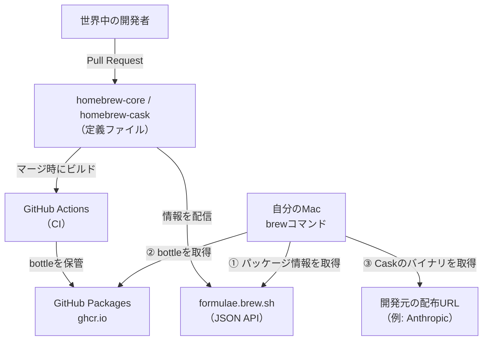

# はじめに

最近は開発作業の多くをAIに任せるようになりました。コードを書くのも、調べ物をするのも、まずはAIに相談するのが当たり前になっています。

ところが、そのAIツール自体を用意するのは、結局これまで通り自分の仕事です。先日もターミナルで動く「Claude Code」を入れようとして、`brew install`と打っている自分に気づきました。AIに何をやらせるにしても、その土台をつくる部分はまだ手作業で残っています。

そのHomebrewを、私はずっとおまじないのように使ってきました。`brew install`が内部で何をしているのかは、正直あまり分かっていません。この記事では、その中身をあらためて追いかけてみます。

:::message
この記事は、Homebrewを使ったことはあるものの、仕組みまでは把握していないという方を対象にしています。Claude Codeのインストールを具体例に、Homebrewが裏側で何をしているのかを理解することをゴールにします。

備忘録として、Homebrewでよく使うコマンドを記事の末尾にまとめておきます。
:::

# Homebrewを使うメリット

macOSには、LinuxのaptやyumのようなOS標準のパッケージ管理ツールが用意されていません。そのため、何も使わなければツールごとに公式サイトからインストーラをダウンロードし、手作業でセットアップすることになります。

この方法には、いくつか面倒な点があります。

- インストールしたツールを一覧で管理できない
- アップデートを各ツールごとに手動で確認する必要がある
- アンインストール時に、どのファイルを消せばいいのか分からない

Homebrewは、これらをまとめて引き受けるパッケージ管理ツールです。`brew install`と打てば、依存関係の解決からパスの設定までを自動で処理します。アップデートもアンインストールも`brew`コマンドに集約されるので、入れたツールを把握しやすくなります。

# Homebrewによるインストールの仕組み

## FormulaとCask

Homebrewでインストールできるパッケージには、大きく分けて**Formula**と**Cask**の2種類があります。両者のいちばんの違いは、そのバイナリを誰がビルドするかという点です。

| 種類    | 誰がビルドするか             | 主な対象                    | 例                             |
| ------- | ---------------------------- | --------------------------- | ------------------------------ |
| Formula | Homebrew（ソースからビルド） | CLIツールやライブラリ       | `git`, `wget`, `jq`            |
| Cask    | 配布元（開発元）             | GUIアプリや配布済みバイナリ | `google-chrome`, `claude-code` |

**Formula**は、ソフトのソースコードをHomebrew側がビルドして配布するものです。`git`や`wget`のようなCLIツールが該当します。**Cask**は、GoogleやAnthropicなどの開発元がすでにビルドして配布しているバイナリを、Homebrewがダウンロードして配置します。Chromeのようなアプリや、今回扱うClaude Codeが該当します。

:::message
Homebrewがあらかじめコンパイルしておいたビルド済みバイナリを、**bottle** と呼びます。本来Formulaはソースコードからビルドする仕組みですが、毎回コンパイルすると時間がかかります。そこでHomebrewは主要なmacOS・CPU向けにbottleを用意しており、`brew install`時に環境に合うbottleがあれば、それをダウンロードして展開するだけで済みます（合うものがなければ、その場で手元のマシンがソースからビルドします）。なお「Formula（レシピ）」「Cellar（貯蔵庫）」「bottle（瓶詰め）」といった名前は、ビールの醸造になぞらえたものです。
:::

今回扱うClaude Codeは、Anthropicが配布しているバイナリをそのまま配置するタイプなので、**Cask**として提供されています。CLIツールではありますが、Homebrewがソースからビルドするのではなく、配布済みのバイナリを置くだけなので、Caskに分類されます。

## インストール先

Homebrewは、すべてのファイルを**プレフィックス**と呼ばれるディレクトリ以下に配置します。このプレフィックスは、MacのCPUによって異なります。

| Mac           | プレフィックス  |
| ------------- | --------------- |
| Apple Silicon | `/opt/homebrew` |
| Intel         | `/usr/local`    |

自分の環境のプレフィックスは、次のコマンドで確認できます。

```sh
$ brew --prefix
/opt/homebrew
```

この記事では、Apple Siliconの`/opt/homebrew`を前提に進めます。

Homebrewでインストールしたツールの実体は、このプレフィックス以下の`Cellar`（Formulaの場合）や`Caskroom`（Caskの場合）というディレクトリに、バージョンごとに格納されます。そして、実際にコマンドとして呼び出す入り口として、`bin`ディレクトリに**シンボリックリンク**が張られます。

## PATHの通し方

ターミナルでコマンドを打つと、シェルは環境変数`PATH`に登録されたディレクトリを順番に探して、該当する実行ファイルを見つけます。

Homebrewを導入すると、`/opt/homebrew/bin`がこの`PATH`に追加されます。Apple Silicon版のインストール時に、次の設定を`~/.zprofile`などへ追記するよう案内されるのも、このためです。

```sh
eval "$(/opt/homebrew/bin/brew shellenv)"
```

この一行で`/opt/homebrew/bin`がPATHに含まれ、Homebrewで入れたコマンドを、どのディレクトリからでも実行できるようになります。

実体をCellarやCaskroomに置き、binにシンボリックリンクを張り、そのbinにPATHを通す。これがHomebrewの基本的な仕組みです。

# Homebrewの裏側の仕組み

ここまではインストールされる側（自分のMac）の話でした。では、`brew install`と打ったときにダウンロードされるツールの情報やバイナリは、どこで、誰が管理しているのでしょうか。

## パッケージ情報の管理方法

FormulaやCaskの定義は、すべてGitHub上のリポジトリでオープンソースとして公開されています。

| リポジトリ               | 管理しているもの               |
| ------------------------ | ------------------------------ |
| `Homebrew/homebrew-core` | Formula（CLIツールなど）の定義 |
| `Homebrew/homebrew-cask` | Cask（GUIアプリなど）の定義    |

たとえばClaude Codeの定義も、[homebrew-caskリポジトリのCaskファイル](https://github.com/Homebrew/homebrew-cask/blob/HEAD/Casks/c/claude-code.rb)として公開されています。どのバージョンを、どこからダウンロードし、どう配置するかが、Rubyのコードとして誰でも読める形で書かれています。先ほどの`brew info`の出力にあった`From:`の行が、この定義ファイルの場所を指しています。

## パッケージ情報のメンテナンス方法

Homebrewは、ボランティアが運営するオープンソースプロジェクトです。ツールの追加やバージョン更新は、世界中の開発者が送るPull Requestとして届き、Homebrewのメンテナがレビューしてマージします。

ただ、膨大なパッケージを人力だけで追うのは現実的ではありません。多くのパッケージでは、`brew livecheck`が新バージョンのリリースを自動で検知し、botが更新用のPull Requestを作成します。Claude Codeのように利用者が多いツールほど、この更新も活発に回っています。

## バイナリのダウンロード場所

パッケージの定義と、バイナリの実体は、別の場所で管理されています。

- Formulaのbottle（ビルド済みバイナリ）は、Pull RequestがマージされるとHomebrewのCI（GitHub Actions）が各macOS・CPU向けにビルドし、GitHub Packages（`ghcr.io`）に保管します。`brew install`は、ここからダウンロードします。
- Caskのバイナリは、Homebrewを経由せず、開発元の配布URLから直接ダウンロードします。Claude Codeなら、Anthropicの配布先から取得します。

## brew実行時の通信先

以前は、`brew update`のたびに`homebrew-core`などのリポジトリを丸ごと`git`で取得していました。現在は、[formulae.brew.sh](https://formulae.brew.sh/)が提供するJSON APIからパッケージ情報を取得する方式が既定で、以前より軽量・高速になっています。この記事で何度か出てきた`brew info`の出力に「Installed using the formulae.brew.sh API」と表示されていたのは、このためです。

ここまでの登場人物を図にすると、次の関係になります。



各要素の役割は次のとおりです。

| 構成要素                          | 役割                                          |
| --------------------------------- | --------------------------------------------- |
| `homebrew-core` / `homebrew-cask` | Formula・Caskの定義を管理するGitHubリポジトリ |
| `formulae.brew.sh`                | パッケージ情報を配信するAPI・Webサイト        |
| GitHub Packages（`ghcr.io`）      | Formulaのbottleを保管・配信するレジストリ     |
| GitHub Actions                    | bottleのビルドやバージョン更新を自動化するCI  |

Homebrewの裏側は、その大半がGitHub上に公開されています。だからインストール前に定義ファイルを自分の目で確認できますし、間違いを見つければPull Requestで直すこともできます。この透明性が、Homebrewを安心して使える理由のひとつだと思います。

# 具体例：Claude Codeのインストールで比較する

ここからは、実際にClaude Codeをインストールする2つの方法を比べて、Homebrewが何を自動で処理しているのかを具体的に見ていきます。

## 公式のインストーラを使う場合

Claude Codeは、公式が提供するインストールスクリプトでも導入できます。

インストール方法は[クイックスタートガイド](https://code.claude.com/docs/ja/quickstart)に記載されていますが、このページは自分で見つけてくる必要があります。

```sh
curl -fsSL https://claude.ai/install.sh | bash
```

この方法では、実行ファイルは`~/.local/bin/claude`に配置されます。ただし、`~/.local/bin`はデフォルトではPATHに含まれていないことも多いため、次の設定を自分で追記する必要がある場合があります。

```sh:~/.zshrc
export PATH="$HOME/.local/bin:$PATH"
```

公式インストーラは、ファイルの配置まではやりますが、PATHを通すところは自分で確認する必要があります。アップデートも、`claude update`というツール自身のセルフ更新に頼る形です。

## Homebrewを使う場合

一方、Homebrewを使う場合はCaskとしてインストールします。

```sh
brew install --cask claude-code
```

これだけで、次の状態になります。まず、コマンドの実体はCaskroom以下にバージョン付きで格納されます。

```sh
$ ls -la /opt/homebrew/Caskroom/claude-code/2.1.185/
-rwxr-xr-x  1 user  staff  215952608  claude
```

あわせて、`/opt/homebrew/bin/claude`から実体へのシンボリックリンクが張られます。

```sh
$ ls -la /opt/homebrew/bin/claude
/opt/homebrew/bin/claude -> /opt/homebrew/Caskroom/claude-code/2.1.185/claude
```

`/opt/homebrew/bin`にはすでにPATHが通っているので、追加の設定なしに、すぐ`claude`コマンドを実行できます。

## 2つの方法は何が違うのか

同じClaude Codeのインストールでも、2つの方法には次の違いがあります。

| 項目             | 公式インストーラ                     | Homebrew（Cask）                                 |
| ---------------- | ------------------------------------ | ------------------------------------------------ |
| 実体の場所       | `~/.local/bin/claude`                | `/opt/homebrew/Caskroom/claude-code/<version>/`  |
| PATHの入り口     | `~/.local/bin`（自分で通す場合あり） | `/opt/homebrew/bin/claude`（シンボリックリンク） |
| アップデート     | `claude update`（セルフ更新）        | `brew upgrade`                                   |
| アンインストール | 手動でファイルを削除                 | `brew uninstall --cask claude-code`              |
| バージョン管理   | ツール任せ                           | Caskroomにバージョンごとに保持                   |

表にすると、配置・PATH・更新・削除を、Homebrewがまとめて肩代わりしていることが分かります。普段は`brew install`の一行で終わる作業の裏で、これだけのことが動いています。

# Homebrewと公式インストーラの選択

ここまで見たように、Homebrewはインストール周りの作業をまとめて引き受けます。

とはいえ、公式手順としてHomebrewと独自のインストーラの両方が案内されるツールも多く、どちらを選ぶか迷う場面があります。判断の目安を挙げておきます。

**Homebrewが適するケース**

- インストール・更新・削除を`brew`コマンドに集約して、まとめて管理したい
- PATHの設定などを自分で気にせず、お任せで済ませたい

**公式インストーラが適するケース**

- リリースされたばかりの最新バージョンを、いち早く使いたい
- ツール自身のセルフアップデート機能で更新したい
- そもそもHomebrewにパッケージがない、または非公式の提供のみで更新が不安

たとえばClaude Codeのように更新が速いツールなら、公式インストーラのセルフ更新で最新を追う手もあります。逆に、多くのツールをまとめて管理したいならHomebrewが向いています。

# よく使うコマンド一覧

最後に、Homebrewの主要なコマンドを表にまとめておきます。

| コマンド                     | 説明                                       |
| ---------------------------- | ------------------------------------------ |
| `brew install <name>`        | Formulaをインストールする                  |
| `brew install --cask <name>` | Cask（GUIアプリなど）をインストールする    |
| `brew uninstall <name>`      | パッケージをアンインストールする           |
| `brew list`                  | インストール済みのパッケージを一覧表示する |
| `brew info <name>`           | パッケージの詳細情報を表示する             |
| `brew update`                | Homebrew本体とパッケージ情報を最新にする   |
| `brew upgrade`               | インストール済みパッケージを更新する       |
| `brew cleanup`               | 古いバージョンや不要なファイルを削除する   |
| `brew doctor`                | 環境の問題点を診断する                     |

`brew update`と`brew upgrade`は名前が似ていて紛らわしいですが、`update`が**カタログ（パッケージ情報）の更新**、`upgrade`が**インストール済みツール本体の更新**、と覚えておくと混乱しません。

:::message
うまく動かないときは、まず`brew doctor`を実行します。PATHの設定ミスや壊れたシンボリックリンクなど、環境の問題点を洗い出して指摘します。トラブル時の最初の一手として覚えておくと役立ちます。
:::

# おまけ：Homebrewの醸造用語

これまで出てきたように、Homebrewには`Formula`や`Cask`、`bottle`といった独特の用語が登場します。どれも「自家醸造（Homebrew）」というテーマにちなんだ、お酒づくりの言葉です。意味を並べると次のようになります。

| 用語       | 元の意味       | Homebrewでの意味                                       |
| ---------- | -------------- | ------------------------------------------------------ |
| `Homebrew` | 自家醸造       | ツールそのものの名前                                   |
| `brew`     | 醸造する       | コマンド名                                             |
| `Formula`  | レシピ・処方   | パッケージのビルド方法を定義したファイル               |
| `bottle`   | 瓶詰め         | あらかじめビルドされたバイナリ                         |
| `Cellar`   | 貯蔵庫         | Formulaの実体が置かれる場所（`/opt/homebrew/Cellar`）  |
| `Keg`      | ビール樽       | Cellar内の、あるFormulaの特定バージョンの置き場所      |
| `Cask`     | 酒樽           | GUIアプリなどの配布済みバイナリを扱う仕組み            |
| `Caskroom` | 樽の貯蔵庫     | Caskの実体が置かれる場所（`/opt/homebrew/Caskroom`）   |
| `Tap`      | 注ぎ口（蛇口） | 公式以外の追加リポジトリを登録する仕組み（`brew tap`） |

由来を知っておくと、コマンド名から役割を思い出しやすくなります。

# まとめ

この記事では、Claude Codeのインストールを例に、Homebrewが裏側で何をしているのかを追いかけました。Homebrewの特徴を最後にまとめます。

- インストール・アップデート・アンインストールを`brew`コマンドで一元管理できる
- 依存関係やPATHの設定を自動で片づけられる
- どんなツールを入れているかを`brew list`で一覧できる

普段は意識せず使っているHomebrewですが、実体を置き、シンボリックリンクを張り、PATHを通すという流れを知っておくと、何か起きたときにも落ち着いて追いかけられます。AIに任せる部分が増えても、その足元を支える道具の中身は、たまに自分で確かめておきたいところです。
