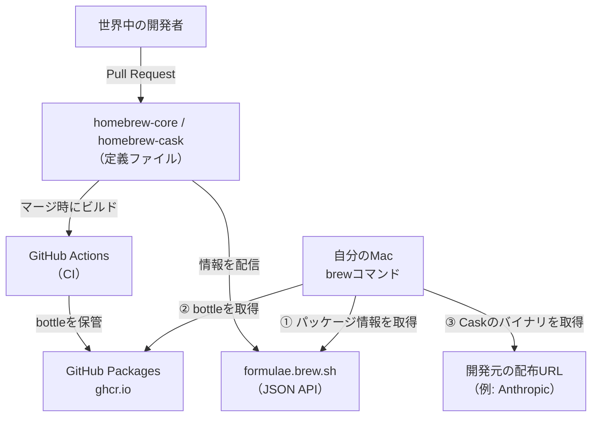

# はじめに

最近は開発作業の多くをAIに任せるようになりました。コードを書くのも、調べ物をするのも、まずはAIに相談するのが当たり前になっています。

ところが、そのAIのためのツール自体をセットアップする場面では、結局これまで通り自分の手を動かす必要があります。最近では、ターミナルで動く「Claude Code」を導入するために`brew install`を実行する必要がありました。**AIを活用するためのツール導入は人間が実行する必要がある**というわけです。

筆者はこれまでHomebrewを「なんとなくのおまじない」として使っていて、内部で何が起きているのかをきちんと理解していませんでした。そこでこの記事では、AI時代にあらためてHomebrewの仕組みをおさらいしてみたいと思います。

:::message
この記事は、Homebrewを使ったことはあるものの、仕組みまでは把握していないという方を対象にしています。Claude Codeのインストールを具体例に、「Homebrewが裏側で何をしているのか」を理解することをゴールにします。

備忘録として、Homebrewでよく使うコマンドを記事の末尾にまとめておきます。
:::

# Homebrewを使うメリット

macOSには、LinuxのaptやyumのようなOS標準のパッケージ管理ツールが用意されていません。そのため、何も使わなければツールごとに公式サイトからインストーラをダウンロードし、手作業でセットアップすることになります。

この方法には、いくつか面倒な点があります。

- インストールしたツールを一覧で管理できない
- アップデートを各ツールごとに手動で確認する必要がある
- アンインストール時に、どのファイルを消せばいいのか分からない

Homebrewは、これらをまとめて解決してくれるパッケージ管理ツールです。`brew install`と打つだけで、依存関係の解決からパスの設定までを自動でやってくれます。アップデートもアンインストールも`brew`コマンドで一元管理できるため、「何をインストールしたのか分からなくなる」という状態を防げます。

# Homebrewによるインストールの仕組み

## FormulaとCask

Homebrewでインストールできるパッケージには、大きく分けて**Formula**と**Cask**の2種類があります。両者のいちばんの違いは、「**そのバイナリを誰がビルドしたのか**」という点です。

| 種類    | 誰がビルドするか             | 主な対象                    | 例                             |
| ------- | ---------------------------- | --------------------------- | ------------------------------ |
| Formula | Homebrew（ソースからビルド） | CLIツールやライブラリ       | `git`, `wget`, `jq`            |
| Cask    | 配布元（開発元）             | GUIアプリや配布済みバイナリ | `google-chrome`, `claude-code` |

**Formula**は、ソフトのソースコードを**Homebrew側がビルドして配布**しているものです。`git`や`wget`のようなCLIツールがこれにあたります。**Cask**は、GoogleやAnthropicといった**開発元が完成品として配布しているバイナリ**を、Homebrewが取ってきて配置するだけのものです。Chromeのようなアプリや、今回扱うClaude Codeがこれにあたります。

:::message
Formulaでは、Homebrewがあらかじめコンパイルしておいた**ビルド済みバイナリ**（**bottle** と呼びます）が使われます。本来Formulaはソースコードからビルドする仕組みですが、毎回コンパイルすると時間がかかります。そこで主要なmacOS・CPU向けにはbottleが用意されており、`brew install`時に環境に合うbottleがあればそれをダウンロードして展開するだけで済みます（合うものがなければ、その場で手元のマシンがソースからビルドします）。ちなみに「Formula（レシピ）」「Cellar（貯蔵庫）」「bottle（瓶詰め）」といった名前は、ビールの醸造になぞらえたものです。
:::

今回扱うClaude Codeは、Anthropicが配布しているバイナリをそのまま配置するタイプなので、**Cask**として提供されています。CLIツールではありますが、Homebrewがソースからビルドするのではなく、配布済みのバイナリを置くだけなのでCaskに分類される、というわけです。

## インストール先

Homebrewは、すべてのファイルを**プレフィックス**と呼ばれるディレクトリ以下に配置します。このプレフィックスは、MacのCPUによって異なります。

| Mac           | プレフィックス  |
| ------------- | --------------- |
| Apple Silicon | `/opt/homebrew` |
| Intel         | `/usr/local`    |

自分の環境のプレフィックスは、次のコマンドで確認できます。

```sh
$ brew --prefix
/opt/homebrew
```

この記事では、Apple Siliconの`/opt/homebrew`を前提に進めます。

Homebrewでインストールしたツールの実体は、このプレフィックス以下の`Cellar`（Formulaの場合）や`Caskroom`（Caskの場合）というディレクトリに、バージョンごとに格納されます。そして、実際にコマンドとして呼び出す入り口は、`bin`ディレクトリに**シンボリックリンク**として作られます。

## PATHの通し方

ターミナルでコマンドを打つと、シェルは環境変数`PATH`に登録されたディレクトリを順番に探して、該当する実行ファイルを見つけます。

Homebrewを導入すると、`/opt/homebrew/bin`がこの`PATH`に追加されます。Apple Silicon版のインストール時に、次のような設定を`~/.zprofile`などに追記するよう案内されるのは、このためです。

```sh
eval "$(/opt/homebrew/bin/brew shellenv)"
```

この一行によって`/opt/homebrew/bin`がPATHに含まれるようになり、Homebrewでインストールしたコマンドを、どのディレクトリからでも実行できるようになります。

「**実体はCellar／Caskroomに置き、binにシンボリックリンクを張り、そのbinにPATHを通す**」というのがHomebrewの基本的な仕組みです。

# Homebrewの裏側の仕組み

ここまではインストールされる側（自分のMac）の話でした。では、`brew install`と打ったときにダウンロードされる**ツールの情報やバイナリは、どこで、誰によって管理されている**のでしょうか。

## パッケージ情報の管理方法

FormulaやCaskの定義は、実はすべて**GitHub上のリポジトリ**でオープンソースとして管理されています。

| リポジトリ               | 管理しているもの               |
| ------------------------ | ------------------------------ |
| `Homebrew/homebrew-core` | Formula（CLIツールなど）の定義 |
| `Homebrew/homebrew-cask` | Cask（GUIアプリなど）の定義    |

たとえばClaude Codeの定義も、[homebrew-caskリポジトリのCaskファイル](https://github.com/Homebrew/homebrew-cask/blob/HEAD/Casks/c/claude-code.rb)として公開されています。「どのバージョンを」「どこからダウンロードして」「どう配置するか」といった情報が、Rubyのコードとして誰でも読める形で書かれています。先ほどの`brew info`の出力にあった`From:`の行が、この定義ファイルの場所を指しています。

## パッケージ情報のメンテナンス方法

Homebrewは、**ボランティアによるオープンソースプロジェクト**です。ツールの追加やバージョン更新は、世界中の開発者からの**Pull Request**によって行われ、Homebrewのメンテナがレビューしてマージします。

とはいえ、膨大な数のパッケージをすべて人力で追いかけるのは大変です。そこで多くのパッケージでは、`brew livecheck`という仕組みで新バージョンのリリースを**自動検知**し、botが更新用のPull Requestを自動で作成するという仕組みを活用しています。

## バイナリのダウンロード場所

パッケージの「定義」と「バイナリの実体」は、別の場所で管理されています。

- **Formulaのbottle**（ビルド済みバイナリ）は、Pull RequestがマージされるとHomebrewのCI（GitHub Actions）が各macOS・CPU向けにビルドし、**GitHub Packages（`ghcr.io`）**に保管します。`brew install`の実行時は、ここからダウンロードされます。
- **Caskのバイナリ**は、**開発元の配布URL**から直接ダウンロードされます。Claude Codeであれば、Anthropicが配布しているバイナリを取得する、という流れです。

## brew実行時の通信先

以前は、`brew update`のたびに`homebrew-core`などのリポジトリを丸ごと`git`で取得していました。しかし現在は、[formulae.brew.sh](https://formulae.brew.sh/)が提供する**JSON API**からパッケージ情報を取得する方式が既定になっており、以前より軽量・高速になっています。この記事で何度か出てきた`brew info`の出力に「Installed using the formulae.brew.sh API」と表示されていたのは、このためです。

ここまで内容を整理すると、Homebrewの裏側を構成する要素や関係性は以下のようになります。



こうして見ると、Homebrewの裏側は、その多くが**GitHubのエコシステム上に構築され、すべて公開されている**ことが分かります。だからこそ、私たちは定義ファイルを事前に確認できますし、おかしな点があればPull Requestで修正を提案することもできます。この透明性により、Homebrewを通じて安心してインストールすることができるようになっています。

# 具体例：Claude Codeのインストールで比較する

ここからは、実際にClaude Codeをインストールする2つの方法を比べて、Homebrewが何を自動でやってくれているのかを具体的に見ていきます。

## 公式のインストーラを使う場合

Claude Codeは、公式が提供するインストールスクリプトでも導入できます。

インストール方法は[クイックスタートガイド](https://code.claude.com/docs/ja/quickstart)に記載されていますが、このページは自分で見つけてくる必要があります。

```sh
curl -fsSL https://claude.ai/install.sh | bash
```

この方法では、実行ファイルは`~/.local/bin/claude`に配置されます。ただし、`~/.local/bin`はデフォルトではPATHに含まれていないことも多いため、次のような設定を自分で追記する必要がある場合があります。

```sh:~/.zshrc
export PATH="$HOME/.local/bin:$PATH"
```

つまり公式インストーラの場合、「**ファイルの配置」はやってくれるが、「PATHを通す」のは自分で確認・対応する必要がある**ことがあるわけです。また、アップデートは`claude update`のように、ツール自身のセルフアップデート機能に頼ることになります。

## Homebrewを使う場合

一方、Homebrewを使う場合はCaskとしてインストールします。

```sh
brew install --cask claude-code
```

これだけで、次のような状態になります。まず、コマンドの実体はCaskroom以下にバージョン付きで格納されます。

```sh
$ ls -la /opt/homebrew/Caskroom/claude-code/2.1.185/
-rwxr-xr-x  1 user  staff  215952608  claude
```

そして、`/opt/homebrew/bin/claude`として、この実体へのシンボリックリンクが自動で張られます。

```sh
$ ls -la /opt/homebrew/bin/claude
/opt/homebrew/bin/claude -> /opt/homebrew/Caskroom/claude-code/2.1.185/claude
```

`/opt/homebrew/bin`にはすでにPATHが通っているので、追加の設定なしに、すぐ`claude`コマンドを実行できます。

## 2つの方法は何が違うのか

同じClaude Codeのインストールでも、2つの方法には次のような違いがあります。

| 項目             | 公式インストーラ                     | Homebrew（Cask）                                 |
| ---------------- | ------------------------------------ | ------------------------------------------------ |
| 実体の場所       | `~/.local/bin/claude`                | `/opt/homebrew/Caskroom/claude-code/<version>/`  |
| PATHの入り口     | `~/.local/bin`（自分で通す場合あり） | `/opt/homebrew/bin/claude`（シンボリックリンク） |
| アップデート     | `claude update`（セルフ更新）        | `brew upgrade`                                   |
| アンインストール | 手動でファイルを削除                 | `brew uninstall --cask claude-code`              |
| バージョン管理   | ツール任せ                           | Caskroomにバージョンごとに保持                   |

こうして並べてみると、Homebrewが「**配置」「PATH」「更新」「削除」をまとめて実行してくれている**ことがよく分かります。普段は`brew install`の一行で済ませてしまいますが、その裏側では、これだけの作業が自動化されているわけですね。

# Homebrewと公式インストーラの選択

ここまで見てきたように、Homebrewはインストールにまつわる作業をまとめて引き受けてくれます。

ただ、多くのツールが公式のインストール手順でHomebrewとそれ以外の手順を提供しているため、どちらを使うべきか悩むことがあります。ここでは選び方の観点を整理しておきます。

**Homebrewが適するケース**

- インストール・更新・削除を`brew`コマンドに集約して、まとめて管理したい
- PATHの設定などを自分で気にせず、お任せで済ませたい

**公式インストーラが適するケース**

- リリースされたばかりの最新バージョンを、いち早く使いたい
- ツール自身のセルフアップデート機能で更新したい
- そもそもHomebrewにパッケージが用意されていない、あるいは非公式の提供のみのため更新が不安

たとえば今回のClaude Codeのように更新が頻繁なツールでは、公式インストーラのセルフアップデートで常に最新を追いかける、という選び方も合理的です。一方で、多くのツールをまとめて面倒みたい場合はHomebrewが快適でしょう。

# よく使うコマンド一覧

最後に、Homebrewの主要なコマンドを表にまとめておきます。

| コマンド                     | 説明                                       |
| ---------------------------- | ------------------------------------------ |
| `brew install <name>`        | Formulaをインストールする                  |
| `brew install --cask <name>` | Cask（GUIアプリなど）をインストールする    |
| `brew uninstall <name>`      | パッケージをアンインストールする           |
| `brew list`                  | インストール済みのパッケージを一覧表示する |
| `brew info <name>`           | パッケージの詳細情報を表示する             |
| `brew update`                | Homebrew本体とパッケージ情報を最新にする   |
| `brew upgrade`               | インストール済みパッケージを更新する       |
| `brew cleanup`               | 古いバージョンや不要なファイルを削除する   |
| `brew doctor`                | 環境の問題点を診断する                     |

`brew update`と`brew upgrade`は名前が似ていて紛らわしいですが、`update`が**カタログ（パッケージ情報）の更新**、`upgrade`が**インストール済みツール本体の更新**、と覚えておくと混乱しません。

:::message
うまく動かないときは、まず`brew doctor`を実行してみます。PATHの設定ミスや壊れたシンボリックリンクなど、環境の問題点を洗い出して教えてくれます。トラブル時の最初の一手として覚えておくと便利です。
:::

# おまけ：Homebrewの醸造用語

これまで出てきたように、Homebrewには`Formula`や`Cask`、`bottle`といった独特の用語が登場します。これらは「Homebrew（自家醸造）」というテーマにちなんで、ビールやお酒の醸造に関連した名称が使われています。整理すると、それぞれ次のような意味になります。

| 用語       | 元の意味       | Homebrewでの意味                                       |
| ---------- | -------------- | ------------------------------------------------------ |
| `Homebrew` | 自家醸造       | ツールそのものの名前                                   |
| `brew`     | 醸造する       | コマンド名                                             |
| `Formula`  | レシピ・処方   | パッケージのビルド方法を定義したファイル               |
| `bottle`   | 瓶詰め         | あらかじめビルドされたバイナリ                         |
| `Cellar`   | 貯蔵庫         | Formulaの実体が置かれる場所（`/opt/homebrew/Cellar`）  |
| `Keg`      | ビール樽       | Cellar内の、あるFormulaの特定バージョンの置き場所      |
| `Cask`     | 酒樽           | GUIアプリなどの配布済みバイナリを扱う仕組み            |
| `Caskroom` | 樽の貯蔵庫     | Caskの実体が置かれる場所（`/opt/homebrew/Caskroom`）   |
| `Tap`      | 注ぎ口（蛇口） | 公式以外の追加リポジトリを登録する仕組み（`brew tap`） |

こうして見ると、名前からなんとなく役割が想像できるものもありますね。用語の由来を知っておくと、コマンドを覚えやすくなると思います。

# まとめ

この記事では、Claude Codeのインストールを例に、Homebrewが裏側で何をしているのかを整理しました。あらためてHomebrewの特徴をまとめると、次のようになります。

- インストール・アップデート・アンインストールを`brew`コマンドで一元管理できる
- 依存関係やPATHの設定を自動で実行してくれる
- どんなツールを入れているかを`brew list`で一覧できる

普段何気なく使っているHomebrewですが、「実体を配置し、binにシンボリックリンクを張り、PATHを通す」という仕組みを理解しておくと、トラブル時にも落ち着いて対処できるようになります。AIに開発を任せる時代だからこそ、その足元を支えるツールの仕組みも、あらためておさえておきたいですね。
