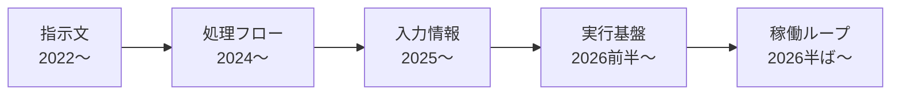

# はじめに

最近、「ループエンジニアリング」という言葉を見かけるようになりました。プロンプトエンジニアリングに始まり、フロー、コンテキスト、ハーネス、そして今度はループ。この数年、AI駆動開発の世界では「〇〇エンジニアリング」という言葉が次々と話題になってきました。

ただ、これらの言葉を時系列に並べてみると、少し見え方が変わってきます。それぞれの用語が流行した時期は、AI駆動開発のボトルネックがどこにあったのかという点と対応しているのです。バズワードの移り変わりはひとつの課題が解決されて、次の課題に名前が付いた結果だと考えています。

この記事では、5つの「〇〇エンジニアリング」を時系列で振り返り、AI駆動開発が何を課題にして、どう乗り越えてきたのかを整理します。先に全体像を示しておきます。

| 用語                         | 流行時期     | 一言でいうと                 |
| ---------------------------- | ------------ | ---------------------------- |
| プロンプトエンジニアリング   | 2022〜2023年 | 一回の指示をどう書くか       |
| フローエンジニアリング       | 2024年       | 処理の流れをどう設計するか   |
| コンテキストエンジニアリング | 2025年       | AIに何を見せるか             |
| ハーネスエンジニアリング     | 2026年前半   | どんな環境で走らせるか       |
| ループエンジニアリング       | 2026年半ば〜 | 回り続ける仕組みをどう作るか |

:::message
この記事はAI駆動開発をすでに実践している方に向けた記事です。各用語の網羅的な解説ではなく、変遷の流れを追うことに主眼を置いています。流行時期は、英語圏で語が広まった時期の目安です。
:::

# プロンプトエンジニアリング（2022〜2023）：一回の指示をどう書くか

2022年11月にChatGPTが公開されたとき、私たちとAIの接点は**1つのプロンプトを入力して、1つの応答を受け取る**だけでした。なので当時は、その1回の指示文をどう書くかに注力しました。これがプロンプトエンジニアリングです。

回答例をいくつか見せてから本題を聞くfew-shotプロンプティング、「ステップバイステップで考えて」と付け加えるだけで正答率が上がるChain-of-Thought（CoT）など、**プロンプトの書き方**のテクニックが次々と発見されました。当時のモデルは今より能力が低く、聞き方ひとつで出力の品質が大きく変わったため、テクニックを知っていること自体に価値があったのです。「プロンプトエンジニアが職業になる」と言われ、実際にAnthropicがプロンプトエンジニアを[高額な年収で募集して話題になった](https://fortune.com/2023/03/09/new-ai-jobs-chatgpt-like-assistants/)のもこの頃です。

現在では、当時のテクニックの多くがほぼ不要になっています。CoTはモデルが標準で行うようになり、推論モデルに対しては「ステップバイステップで考えて」といった指示が[むしろ不要とされる例](https://developers.openai.com/api/docs/guides/reasoning-best-practices)も出てきました。あのころに覚えたやり方は、モデルの進化とともに役目を終えました。

ただし、消えたのは小手先のテクニックだけであって、**曖昧な依頼からは曖昧な結果しか返ってこない**という根幹の部分は、形を変えて次のフェーズに引き継がれていきます。

# フローエンジニアリング（2024）：一発回答から反復フローへ

2024年に入ると、**1回の指示文を磨き込むより、処理の流れを設計するほうが有効である**という発見が注目を集めます。きっかけは2024年1月に発表された[AlphaCodium](https://arxiv.org/abs/2401.08500)です。

AlphaCodiumは競技プログラミングの問題を解くシステムで、論文のタイトルにはっきりと「From Prompt Engineering to Flow Engineering」と書かれています。単発のプロンプトで完璧な回答を狙うのではなく、問題を分析し、コードを生成し、テストを実行し、失敗したら修正する、という反復のフローを設計したところ、単発プロンプトを大きく上回る成績を出しました。Andrej Karpathy氏がこの成果を「プロンプトエンジニアリングというよりフローエンジニアリング」と[紹介した](https://x.com/karpathy/status/1748043513156272416)ことで、用語として広まりました。

振り返ると、これは人間の関心が一段上に移った転換点でした。プロンプトエンジニアリングの時代に見ていたのは指示文そのものでしたが、フローエンジニアリングが注目しているのは**AIにどういう手順で作業させるか**です。1回の応答の品質を上げる工夫から、複数回の応答を組み合わせて成果に到達させる工夫へ。今のCoding Agentが当たり前に実行している「書いて、実行して、直す」の原型が、ここにありました。

# コンテキストエンジニアリング（2025）：AIに何を見せるか

2025年の半ば、ShopifyのCEOであるTobi Lütke氏が「プロンプトエンジニアリングよりコンテキストエンジニアリングという呼び方のほうが、この技能の中身を正しく表している」と[発言し](https://x.com/tobi/status/1935533422589399127)、Karpathy氏がこれに同意したことで、コンテキストエンジニアリングという語が一気に広まりました。

背景には2つの変化があります。1つはコンテキストウィンドウの拡大です。モデルに渡せる情報量が桁違いに増え、**どう書くか**より**何を入れるか**が出力品質を左右するようになりました。もう1つはCoding Agentの実用化です。Claude CodeやCursorのようなツールでは、人間が書く指示文は数行でも、その裏でコードベース、ドキュメント、ツール定義、会話履歴といった大量の情報がモデルに渡されています。入力するコンテンツの設計こそが重要だ、という認識を言語化したのがコンテキストエンジニアリングです。

もっとも、この考え方は先に実践されていました。その代表例がRAG（Retrieval-Augmented Generation）です。外部の知識を検索してモデルの文脈に注入するという手法は[2020年に提案され](https://arxiv.org/abs/2005.11401)、用語の流行前から広く使われていました。

この時代の産物として、CLAUDE.mdやAGENTS.mdのような「プロジェクトに常駐するコンテキスト」も定着しました。リポジトリの規約や構成をファイルとして置いておき、エージェントに毎回読ませる。指示文を毎回書く代わりに、見せるものをあらかじめ整備しておくという発想は、まさにコンテキストエンジニアリングの実装です。

# ハーネスエンジニアリング（2026年前半）：エージェントの実行環境を整える

2025年の後半になると、エージェントは数分ではなく数時間のタイムスパンで自律的に動くようになりました。すると新しい問題が発生しました。1回の推論に渡すコンテキストをいくら磨いても、長い作業の途中で脱線したり、間違いに気づけないまま突き進んだりするのです。ボトルネックは**1回の推論の質**から**作業全体をどう実行させるか**に移りました。

ここに付いた名前がハーネスエンジニアリングです。2026年2月の[Mitchell Hashimoto氏のブログ](https://mitchellh.com/writing/my-ai-adoption-journey)での使用が初出とされ、ほどなくして[LangChain](https://www.langchain.com/blog/improving-deep-agents-with-harness-engineering)やOpenAIも公式ブログでこの用語を扱うようになりました。ハーネス（harness）はモデルの周辺にある実行基盤の総称で、エージェントに与えるツール、権限の範囲、作業結果を検証する仕組み、失敗したときのフィードバック経路などを含みます。モデルそのものではなく**モデルの周辺**を設計するのがこの実践です。

面白いのは、ここで再評価されたのが昔ながらのエンジニアリング資産だったことです。lint、テスト、型チェック、CI。人間のために整備してきたこれらの仕組みは、エージェントが自分の作業の正しさをその場で確かめる手段としても機能します。テストが充実したコードベースほどエージェントがうまく働くという経験則は、多くの実践者が実感していると思います。AIのための特別な何かを作る前に、足元の開発環境を整えることがそのままAI駆動開発への投資になる。ハーネスエンジニアリングはそういう発見でもありました。

# ループエンジニアリング（2026年半ば〜）：プロンプトを設計する人から、ループを設計する人へ

そして2026年6月現在では、[ループエンジニアリング](https://www.oreilly.com/radar/loop-engineering/)という用語が急速に広まっています。エージェントに1つずつタスクを依頼するのをやめて、エージェントが自分で仕事を見つけ、実行し、検証し、記録して、また次の仕事に向かう。その回り続けるループそのものを人間が設計する、という考え方です。

ハーネスエンジニアリングまでの世界では、まだ人間がプロンプトを打っていました。作業の大部分をエージェントに任せるとしても、「これをやって」と依頼する起点は人間です。ループエンジニアリングはその起点さえも仕組みに置き換えます。タスクの発見方法、完了の判定基準、作業記録の残し方を定義しておけば、エージェントは人間が寝ている間も回り続けます。人間の役割は**プロンプトを打つ人**から**ループを設計し、監視する人**に変わりました。

これが現時点での最前線です。数か月後には、また別の「〇〇エンジニアリング」が話題の中心になっているかもしれません。

# 抽象度の階段を登る

ここで、5つの用語を振り返ってみます。注目したいのは、それぞれの時代に「人間が直接手を触れていたレイヤー」です。

| 用語                         | 人間が直接触るもの               |
| ---------------------------- | -------------------------------- |
| プロンプトエンジニアリング   | 指示文そのもの                   |
| フローエンジニアリング       | 指示を組み合わせた処理の流れ     |
| コンテキストエンジニアリング | 流れに乗せる入力情報             |
| ハーネスエンジニアリング     | 情報と道具を備えた実行基盤       |
| ループエンジニアリング       | 基盤の上で回り続ける稼働の仕組み |

こうすると一貫した流れが見えてきます。人間が関与する箇所は、指示文という最も具体的なレイヤーから、フロー、情報、基盤、ループへと、一段ずつ抽象度の高いレイヤーに移ってきました。逆にいえば、それより下のレイヤーは順にAI側へ委譲されてきたということです。

なぜこうなるのかも説明が付きます。各時代の「〇〇エンジニアリング」は、当時のモデルの弱さを人間の工夫で補うための名前でした。そしてモデルが進化してその弱さが解消されると、工夫は不要になり、人間の手は次のボトルネックへ移ります。プロンプトのテクニックはモデルに吸収され、反復フローはCoding Agent製品の内部に組み込まれ、コンテキストの整備はCLAUDE.mdのような定番の形に落ち着きました。

なので、どの用語の考え方も不要になったわけではありません。下のレイヤーに入り込み、当たり前になっただけです。今この瞬間もプロンプトは書かれ、フローは回り、コンテキストは注入されています。名前が付くのはいつも、人間の工夫がまだ必要な最前線のタスクというわけです。

# おわりに：仕事を依頼する

ここまで振り返ると、この階段はどこかで見たことがあると気づきます。人間に仕事を任せるときの階段と同じなのです。

新しいメンバーに仕事をお願いする場面を思い浮かべてください。最初は口頭でひとつずつ指示します（プロンプト）。慣れてきたら、作業の手順ややり直しの基準をすり合わせます（フロー）。さらに、必要な資料や背景情報をまとめて渡すようになり（コンテキスト）、権限を付与して、質問や確認の経路を整えます（ハーネス）。最終的には、自分でタスクを見つけて進め、結果だけ報告してもらう体制を作ります（ループ）。

優れたマネージャーやテックリードが人間相手にやってきたことと、私たちがこの4年弱でAI相手にやってきたことは、完全に重なっています。

つまり、AI駆動開発の変遷の本質は、AI固有の技術トレンドというより**仕事の仕組み化**なのだと思います。相手の能力が上がるにつれて、指示は具体から抽象へ、関与は都度から設計へと移っていく。それは相手が人間でもAIでも変わりません。

この見立てから、次の「〇〇エンジニアリング」がどのあたりに来るかも見当が付きます。人間の組織で**任せて回る仕組み**の次に来るのは、複数のチームをどう編成し、組織全体にどう組み込むかです。AIでも同じように、複数のループの編成や、組織へのエージェントの統合あたりに、次の名前が付くのではないでしょうか。

新しい用語が出てくるたびに焦る必要はありません。それは**いま人間の工夫が必要なレイヤーがここに移った**という合図にすぎないからです。追いかけるべきは、自分の開発の今のボトルネックがどのレイヤーにあるかという点です。そこさえ見えていれば、次にどんな「〇〇エンジニアリング」が流行っても、落ち着いて迎えられるはずです。
