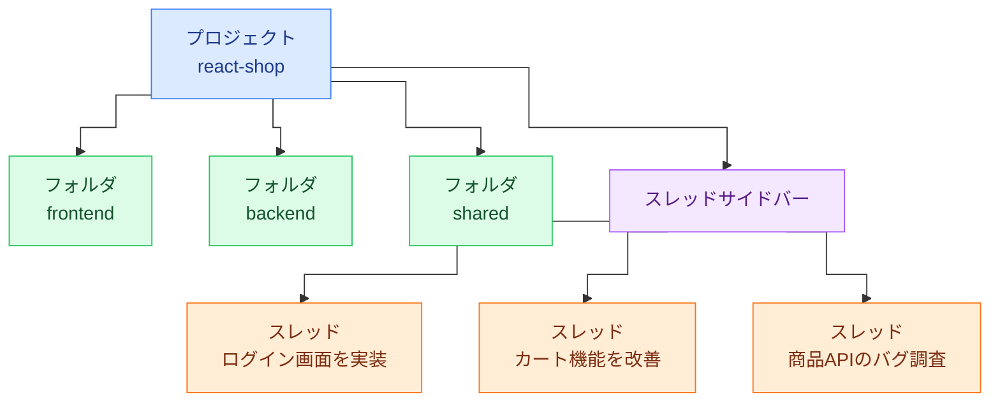

コードを書くとき、頭のなかに「こうしたい」というイメージがあります。ファイルを横断して変数を追い、実装の方針を決め、テストが通るまで繰り返す。ZedのAgent Panelは、そのプロセスにエージェントを引き込む場所です。単純なコード補完ではなく、ファイルを読み、コードを書き換え、コマンドを実行するエージェントが、開発の流れにそのまま参加します。

他のエディタでAIを使う場合、チャットウィンドウとエディタを行き来しながら、コードを手でコピーして貼り付ける手順が発生しがちです。Zedはその往復をなくす方向で設計されており、Agent Panelは単なるチャット窓ではなく、プロジェクトへの直接アクセス権を持つ作業台です。エージェントがファイルを編集した結果はエディタのバッファにすぐ反映され、変更の承認や差し戻しもその場でできます。

本章ではAgent Panelの開き方から始め、LLMプロバイダーの選択、コンテキストの渡し方、エージェントが行った変更のレビュー、ツールの制御、そして外部エージェントとの連携まで、一通りの流れを追います。最後には小さな機能追加を例に、エージェントと並走しながら開発を進めるウォークスルーも示します。なお、インラインアシスタントやEdit Predictionについては第4章で、MCPサーバーの拡張については第8章で詳しく述べます。

## Agent Panelの全体像

Agent Panelは、Zedにおけるエージェント開発の中心的なインターフェースです。コマンドパレット（`cmd-shift-p`）から `agent: new thread` を実行するか、ステータスバー右端の ✨ アイコンをクリックすると開きます。ウィンドウ右端にパネルが現れ、メッセージ入力欄とスレッドが並びます。


_Agent Panelの画面構成。メッセージを書き、モデルを選んで送信する_

「スレッド」はエージェントとの一連の対話をひとまとめにした単位です。プロジェクトごとに複数のスレッドを並行して走らせられます。スレッド一覧はスレッドサイドバー（`cmd-alt-j`）で確認でき、過去のスレッドをアーカイブしたり、履歴から呼び戻したりできます。新しいスレッドを開くには `cmd-n`、スレッド間の切り替えは `ctrl-tab` が使いやすいです。生成が完了したときの通知は、視覚的な表示と音の両方を設定できるため、バックグラウンドで処理を走らせながら別の作業を続けるときに便利です。

はじめのうちは、スレッド・プロジェクト・フォルダ・スレッドサイドバーの関係が掴みにくいかもしれません。たとえばReactでショッピングサイトを開発しているケースを例に、組織図のように整理すると次のようになります。



- **プロジェクト**（図の `react-shop`）は、Zedで開いている作業単位です。ひとつのウィンドウがひとつのプロジェクトに対応し、その下に1つ以上のフォルダをぶら下げます。
- **フォルダ**（`frontend`／`backend`／`shared`）は、プロジェクトのルートに置かれた実際のディレクトリです。ファイルツリーやファイル検索の対象範囲であり、エージェントが読み書きできる領域でもあります。フロントエンドとバックエンドを1つのプロジェクトにまとめる、といった構成が典型です。
- **スレッド**（`ログイン画面を実装` など）は、エージェントとの一連の対話です。ひとつのプロジェクトに複数持てます。スレッドが `@` メンションで参照できるファイルは、そのプロジェクトがぶら下げているフォルダの中から選ばれます。
- **スレッドサイドバー**は、いま開いているプロジェクトのスレッドを一覧するUIです。別のプロジェクト（別ウィンドウ）を開けば、そこには別のスレッド群が並びます。

つまり、プロジェクトの下にフォルダとスレッドがぶら下がり、スレッドサイドバーはそのスレッド群を映す窓、という組織図として捉えると分かりやすくなります。

スレッド内では、送信済みのメッセージを後から編集して再送信することができます。文脈が足りなかったと気づいたとき、ファイルを追加してもう一度試すといった使い方です。また、生成中でも次のメッセージを入力して送信できます。送ったメッセージはキューに積まれ、現在の生成が終わると順番に処理されます。

パネル上部のモデルセレクターでは、使用するLLMをスレッドごとに切り替えられます（`cmd-alt-/`）。よく使うモデルにはスターを付けてお気に入り登録しておくと、切り替えがすばやくなります。ここで選んだモデルに応じて、エージェントが持つ能力と使えるツールが変わります。

## LLMプロバイダーを選ぶ

### Zedホステッドモデル

最もすぐに使い始められるのが、Zed自身がホストするモデルです。AnthropicのClaude、OpenAIのGPT、GoogleのGeminiといった系統のモデルが揃っており、APIキーを用意しなくてもZedアカウントにログインするだけで試せます。

料金の仕組みはシンプルで、トークン消費量をドルに換算してアカウントに積み上げていきます。Zed Proプランには毎月5ドル分のトークンクレジットが含まれており、それを超えた分はプロバイダーの利用レートに約10%が加算された金額で請求されます。新規ユーザーは14日間有効な20ドル分のトライアルクレジットを受け取れます。Freeプランでもサインインすれば一部のモデルをごく限られた範囲で試せますが、本格的に使うにはProプランが現実的です。上位モデル（Claude OpusシリーズやGPT-5.5 proなど）はProまたはBusinessプランのみで利用できます。

Zedホステッドモデルの利点は、APIキー管理の手間がない点と、プロバイダーの直接APIよりも高いレートリミットが設定されている点です。

### 自前のAPIキーを使う

AnthropicやOpenAI、Google AI（Gemini）、Mistral、DeepSeek、xAIなどのプロバイダーには、自前のAPIキーで接続することもできます。コマンドパレットから `agent: open settings` を実行してAgent Settingsパネルを開き、各プロバイダーの欄にAPIキーを入力します。ここで入力したキーはmacOSのキーチェーンに保存されるため、`settings.json` には書かれません。

環境変数でキーを渡す方法もあります。`ANTHROPIC_API_KEY`、`OPENAI_API_KEY`、`GEMINI_API_KEY` といった変数をZedの起動環境にセットすれば、キーチェーンの値よりも優先して使われます。シェルのプロファイルに書いておくのが手軽です。

OpenAI互換のゲートウェイ（OpenRouterやAWS Bedrockなど）も利用でき、企業環境でプロキシを挟む場合は `language_models.<provider>.custom_headers` にカスタムHTTPヘッダーを設定できます。Ollamaのようなローカルモデルも選択肢に含まれます。

## スレッドとコンテキストの渡し方

### @メンションでコンテキストを追加する

エージェントに意図を正確に伝えるには、渡す情報の質が重要になります。Agent Panelのメッセージ入力欄で `@` を入力すると補完メニューが出て、次のようなものをメンションできます。

- **ファイルやディレクトリ**：`@src/lib/auth.ts` のようにパスをメンションすると、そのファイルの内容が渡される
- **シンボル**：関数や型を名前でピンポイントに指定できる
- **スレッド**：過去の対話の内容を参照させられる
- **診断情報（Diagnostics）**：現在のエラーや警告をそのまま渡せる
- **ブランチ差分**：現在のブランチで変更したすべての差分を一度に含められる
- **URL**：外部のドキュメントやページをその場で取得させられる


_@ を打つとコンテキスト補完メニューが展開される_

複数行のコードをペーストすると、Zedは自動的に@メンション形式に変換します。プレーンテキストとしてそのままペーストしたいときは `cmd-shift-v` を使います。

### 選択範囲をスレッドに送る

エディタ上でコードを選択し、`cmd->` を押すか `agent: add selection to thread` を実行すると、その選択範囲がスレッドに追加されます。「このメソッドの動作を説明して」といったピンポイントな質問に向いています。

ビジョン対応のプロバイダーを使っている場合は、スクリーンショットや図をそのままスレッドに添付することもできます。

### コンテキストウィンドウとトークン管理

スレッドが長くなると、コンテキストウィンドウの上限に近づきます。パネルのプロファイルセレクター付近でトークン消費量をドル換算で確認でき、上限に近づくと自動的に会話の要約（コンパクション）が行われます。重要なやり取りが消えることを防ぎたい場合は、要点のみを新しいスレッドに引き継ぐとよいでしょう。コンパクションが入るタイミングは制御できませんが、「現在の設計方針を要約してから続けて」などとエージェントに頼んでおくと、引き継ぎの精度が上がります。

## エージェントがコードを変える

### 組み込みツールと承認フロー

Writeプロファイル（後述）のエージェントは、ファイルの読み書きやディレクトリ操作、ターミナルでのコマンド実行など、プロジェクトへの幅広いアクセス手段を持ちます。各ツール呼び出しにはツールカードがスレッドに表示されます。

ツールごとに権限（Permission）が設定されており、その状態によって挙動が変わります。初回にカードが現れると次の選択肢が提示されます。

- **Allow once**：今回の呼び出しだけ許可する
- **Deny once**：今回だけ拒否する
- **Always for ...**：以後このツールに対して常に許可（または拒否）する


_ツール呼び出しのたびに表示されるツールカード。繰り返し使うコマンドは「Always for」で自動許可できる_

ターミナル実行など影響の大きいアクションでは、デフォルトで確認が求められます。繰り返し使うコマンド（`npm run test` など）は「Always for」で自動許可に設定しておくと、作業が流れやすくなります。

### 編集結果のレビュー

エージェントがファイルを編集し終えると、スレッドに変更を受けたファイルと行数が一覧表示されます。アコーディオンを展開するか `Shift Ctrl R` を押すと、マルチバッファのレビュータブが開きます。ここで変更されたファイルを横断的に確認し、ハンク単位または変更セット全体で承認か拒否を選べます。


_Shift-Ctrl-R で開くレビュータブ。ハンク単位で変更の承認・拒否ができる_

`agent.single_file_review` を設定すると、ファイルを一つひとつ並べてインラインで確認するモードに切り替わります。変更量が多いときは通常のマルチバッファビュー、単一ファイルの細かい確認にはインラインレビューと使い分けるとよいでしょう。

### チェックポイントで前の状態に戻る

エージェントがコードを書き換える前には自動的にチェックポイントが作られます。結果が望ましくなかったときは「Restore Checkpoint」ボタンを押せば、編集前の状態に戻せます。Gitのコミットを積まずにいつでも巻き戻せるのは、実験的な変更を試すときに心強い安全弁です。また、Agent Panelでエージェントが開いたファイルをリアルタイムで追うには、スレッド上部のクロスヘアアイコンをクリックすると、エージェントが操作しているファイルへカーソルが自動的に追随します。

## プロファイルでツールを制御する

### Write / Ask / Minimal

エージェントが持てるツールセットを決めるのがプロファイルです。組み込みのプロファイルは3種類あります。

| プロファイル | できること                                                                   |
| ------------ | ---------------------------------------------------------------------------- |
| **Write**    | ファイルの読み書き、ディレクトリ操作、ターミナル実行。フルアクセス           |
| **Ask**      | `read_file` や `grep` など読み取り専用のツールのみ。コードベースへの質問向け |
| **Minimal**  | プロジェクトへのアクセスなし。モデルの素の能力のみ                           |

プロファイルの切り替えはAgent Panel上部のセレクターから行います。「Configure」ボタンを押すか、コマンドパレットで `agent: manage profiles` を実行するとプロファイルの管理画面が開き、既存プロファイルのフォークやデフォルトモデルの設定、ツールの個別有効化などをカスタマイズできます。

### ツール許可の細かい制御

プロファイルがツールの有無を決めるのに対し、Tool Permissionsは「実行の可否をいつ・どのように判断するか」を決めます。正規表現パターンでツール入力をマッチさせ、常に許可・常に拒否、あるいは都度確認のいずれかを割り当てられます。ハードコードされたルールも存在し、`rm -rf /` のような危険なコマンドはパターンに関係なく拒否されます。

普段よく使うコマンドにパターンを書いておくと、確認のクリックが減って開発の流れが途切れにくくなります。設定は `settings.json` の `agent.tool_permissions` で管理します。

## 外部エージェントをZedから使う

### Agent Client Protocol（ACP）

ZedはZed Agent（ネイティブエージェント）のほかに、外部エージェントとの連携手段を持っています。その仕組みがAgent Client Protocol（ACP）です。ACPを介して接続された外部エージェントは、Zedのスレッドサイドバーに並んで表示され、通常のスレッドと同じ感覚で扱えます。

ただし、外部エージェントはランタイムや認証、モデル選択、ツール設定のすべてを自前で管理します。Zedはあくまでスレッドのホストとして機能し、課金もZedを経由せず各プロバイダーに直接発生します。

### ACP RegistryからClaude Agentを使う

外部エージェントの追加は、コマンドパレットで `zed: acp registry` を実行するか、Agent Settingsの「Install from Registry」から行います。レジストリにはClaude AgentやCodex、Gemini CLI、OpenCode、Copilotなど主要なエージェントが並んでいます。

たとえばClaude Agentを使う場合、インストール後に新しいスレッドメニューから「Claude Agent」を選んでスレッドを開き、チャットで `/login` を実行すればAPIキーまたはClaude Codeの認証で接続できます。以降はZedのAgent Panel上でClaude Agentの機能一式が使えます。

### Terminal Threadsでクラウドを持ち込む

もう一つの選択肢がTerminal Threadsです。ACPを介さず、ターミナルをそのままAgent Panelのスレッドとして扱う仕組みで、Claude Code（`claude`）やその他のCLIツールをZedのウィンドウ内から起動できます。新しいスレッドのメニューで「Terminal」を選ぶと、ターミナルスレッドが開きます。

`agent.terminal_init_command` を設定しておけば、新しいターミナルスレッドを作るたびに指定したコマンドが自動実行されます。毎回 `claude` と打つ手間が省けます。ターミナルスレッドのモデル選択や認証、設定は、そのCLIツール自身が管理します。ZedはUIのコンテナを提供するだけです。

```jsonc
// settings.json
{
  "agent": {
    "terminal_init_command": "claude"
  }
}
```

### Claude Codeユーザーはどの方法を選ぶか

ここまで、ZedでAIを使う方法をいくつも見てきました。Zed本体のネイティブエージェント、ACPを介した外部エージェント、そしてターミナルをそのままスレッドにするTerminal Threadsです。選択肢が揃ったところで、すでにClaude Codeを日常的に使っている人の視点から整理し直してみましょう。

Claude Codeユーザーがその開発体験をZedに持ち込むには、大きく3つの入口があります。同じ「AIと開発する」でも、統合の深さと、モデルや認証を管理する主体がそれぞれ異なります。

| 観点                  | Zed Agent（Zed公式）                                               | Claude Agent（ACP経由）                                                | Claude Code（ターミナルスレッド）                          |
| --------------------- | ------------------------------------------------------------------ | ---------------------------------------------------------------------- | ---------------------------------------------------------- |
| 実体                  | Zed本体のネイティブエージェント                                    | ACPで接続する外部のClaude Agent                                        | Zed内蔵ターミナルで起動する `claude` CLI                   |
| モデル・認証          | Zedホストモデルまたは自前のAPIキー                                 | エージェント側で管理（`/login`でAPIキーかClaude Code認証）             | Claude Code自身が管理                                      |
| 課金                  | Zed経由（自前キーならプロバイダーに直接）                          | プロバイダーに直接                                                     | Anthropic（Claude Code）に直接                             |
| Zed UIとの統合        | フル（ツールカード・差分レビュー・チェックポイント・プロファイル） | スレッドサイドバーに統合。ツールやレビューはエージェント側の作法に従う | 限定的（ターミナル扱いで、差分レビューなどとの連携は薄い） |
| Claude Codeの使い勝手 | 利用不可（Zed独自のツール群を使う）                                | ACPが対応する範囲でClaude Agentの機能を利用                            | CLIそのものなので、普段のClaude Codeの体験がそのまま       |
| 向いている人          | ZedのUI機能を最大限に使い、AIをエディタへ深く統合したい人          | Zedのスレッド管理に乗せつつClaude系のエージェントを動かしたい人        | いつものClaude Codeを、場所だけZedに移したい人             |

大まかな指針としては、ツールカードや差分レビュー、チェックポイントといったZedのUI機能を最大限に活かしたいならZed Agent、Zedのスレッドサイドバーで整理しながらClaude系のエージェントを使いたいならACP経由のClaude Agent、普段のClaude Codeの操作感をそのまま持ち込みたいならターミナルスレッド、という選び分けになります。ターミナルスレッドはどんなCLIツールでも同じように扱える汎用性が魅力ですが、その代わりZed側のUI機能との連携は限定的になる、というトレードオフを押さえておくとよいでしょう。

## 拡張として足すか、コアに組み込むか

VS Codeも2025年以降のagentモードでは、GitHub Copilotを通じてマルチファイル編集・ツール承認・ターミナル実行の確認・MCP対応・モデル選択（ClaudeやGeminiを含む）・チェックポイント復元まで、一通りのことができます。「ZedにしかできないAI機能がある」という語り方は正確ではありません。差は機能の有無ではなく、AIをエディタにどう組み込むかという設計の考え方にあります。

VS CodeのAIは、GitHub Copilotという公式拡張機能を軸にしながらも、ClineやContinueといった独立した拡張機能が並立する構図になっています。拡張ごとにUIが異なり、コンテキストの渡し方も設定の置き場所も違う。別の拡張に乗り換えれば、作法を一から覚え直すことになります。Zedでは、本章で見てきたツールカード・マルチバッファのレビュータブ・チェックポイント・Write/Ask/Minimalのプロファイルが、ひとつのネイティブエージェントの一貫したUIとして収まっています。拡張として後から足したのではなく、最初からこの形で設計されています。

そのうえで、Zedは特定のベンダーに閉じているわけではありません。ACPを介してClaude AgentやGemini CLI、Codexといった外部エージェントをスレッドサイドバーへ対等に並べられ、Terminal Threadsを使えば任意のCLIツールも同じウィンドウに持ち込めます。「Zedの一貫したUI」と「使うエージェントを選ぶ自由」を両立させています。Copilotを中心に据えながら複数の拡張が横に並ぶVS Codeとは、設計の出発点が異なります。

ZedとVS Codeの選択は、機能を一つひとつ数えて比べるたぐいのものではありません。AIをエディタの外付けオプションとして扱うか、編集操作そのものの一部として組み込むか、という問いです。第1章で触れた「発想の逆転」が、この章を通じて具体的な仕組みとして形をとっています。

## MCPサーバーでさらに広げる

Zed AgentはModel Context Protocol（MCP）に対応しており、外部のツールやデータソースをサーバーとして接続できます。GitHubやPuppeteer、Figmaなどのサーバーが拡張機能として配布されており、コマンドパレットから `zed: extensions` で追加できます。MCPサーバーの設定と活用については第8章で詳しく扱います。

## 実践：エージェントと機能追加を進める

ここでは「既存のNode.jsのCLIツールに `--json` フラグを追加する」という小さな機能追加を例に、Agent Panelを使った実際の流れを追ってみます。

まず `cmd-n` で新しいスレッドを開き、プロファイルをWriteに設定します。次のようなメッセージを送ります。

```
@src/cli.ts @src/types.ts

`--json` フラグを追加してください。このフラグが指定された場合、
通常の標準出力の代わりにJSON形式で結果を出力します。
既存の出力ロジックはそのまま活かしてください。
```

`@src/cli.ts` と `@src/types.ts` をメンションすることで、エージェントはファイルの内容を最初から把握した状態で動き始めます。

エージェントはまず両ファイルを読み込み、実装方針を説明してきます。問題がなければそのまま進めてもらうか、「テストファイルも更新して」「コメントは既存のスタイルに合わせて」などの追加指示を送ることができます。

編集が終わると変更ファイルの一覧が表示されます。`Shift Ctrl R` でレビュータブを開き、型の変更やフラグのパース処理、出力切り替えのロジックを一通り確認します。意図と異なる変更があればハンク単位で拒否し、その旨をスレッドで伝えて修正を依頼します。全体が問題なければ変更を承認し、続けてターミナルスレッドか通常のターミナルでテストを走らせます。

一連の流れで重要なのは、エージェントに丸投げするのではなく、情報を丁寧に渡し、提案を確認しながら進めることです。渡す情報が詳しいほど、エージェントの最初の提案が的確になり、往復の回数が減ります。Zedでの開発においても、そこだけは変わりません。

うまくいかないときはスレッドで問い直し、チェックポイントに戻してやり直せばよいです。複雑な変更であれば、まずAskプロファイルで設計を相談し、方針が固まったらWriteプロファイルに切り替えて実装を依頼するという使い分けも有効です。エージェントに対しても、いきなり全部任せるより、小さく切り出して段階的に確認しながら進める方が結果が安定します。
